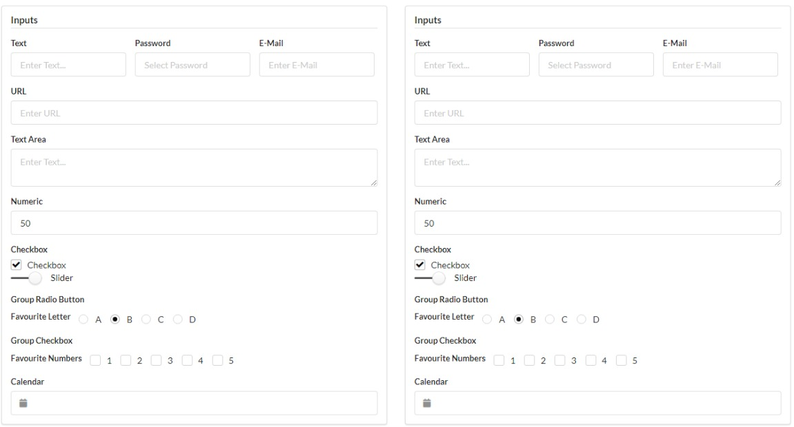
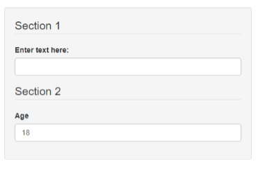

A couple of weeks ago I was looking around for different CSS frameworks to play around with, and came across [*Semantic HTML*](https://blog.hubspot.com/website/semantic-html) (**not** to be confused with [Semantic UI](https://semantic-ui.com/)) and I'm hooked! There are several "classless CSS frameworks" that are implemented under the ideology of Semantic HTML: styling of elements (e.g. height and colour) is applied to the HTML tags rather than classes, meaning that the HTML is less of a sea of <code>&lt;div&gt;</code> and <code>&lt;span&gt;</code> tags with 6 or 7 classes, and more of a wider range of HTML tags that better explain what is contained in the web page.

Some examples include:

- [Pico.css](https://picocss.com/)
- [Sakura](https://oxal.org/projects/sakura/)
- [Almond.CSS](https://alvaromontoro.github.io/almond.css/demo/)
- [MVP.css](https://andybrewer.github.io/mvp/)
- [Classless.css](https://classless.de/) <sup>* Despite its name, Classless.css does include a few classes to create grids and cards</sup>

## Why use Semantic HTML?

One of the key things about making a good UI is to ensure that it is accessible as possible. Screen readers don't take any account of JS or CSS within a web page, so having Semantic HTML at least provided a basic level of structure and understanding for all. When over 2% of Americans would benefit from screen readers<sup>[1](https://nfb.org/blindness-statistics),[2](https://ux.stackexchange.com/a/119596/157481)</sup>, this should be considered for any {shiny} application.

There is also a file size advantage using classless css over the more commonly seen frameworks. For example, the most recent release of Bootstrap (5.1.3) is 161kB (and that doesn't include all of the JavaScript required for components like modals), whereas some of these classless frameworks can be as small as a couple of kilobytes ([Sakura](https://github.com/oxalorg/sakura) is only 4kB and isn't even 200 lines long). The smaller files mean that web pages load quicker and are less prone to unexpected behaviour.

Trade-offs are bound to occur; the more well known frameworks have been updated and iterated for years, and include many components and features that won't be available in these classless frameworks, making it much quicker to build an application without writing any extra CSS. They have also been including more accessibility features by using <abbr title="Accessible Rich Internet Applications">ARIA</abbr> attributes (a list of all attributes are available on [Mozilla Web Docs](https://developer.mozilla.org/en-US/docs/web/Accessibility/ARIA/Attributes)), they provide enhanced accessibility compared to Semantic HTML.

You don't need to use a classless framework to make it more semantic. Simply by changing the <code>&lt;div&gt;</code> and <code>&lt;span&gt;</code> tags within your existing framework is sometimes enough. Because most styling is attached to the classes rather than the components, changing these tags will not affect the UI but will make the web page more accessible.

<figure>



<figcaption>
Both of these UIs are using the same classes, one with <code>&lt;div&gt;</code> elements and the other with Semantic HTML<sup>3</sup>.
</figcaption>
</figure>

## Semantic HTML in Shiny Applications

Here are a few simple changes that can be applied to any {shiny} application that can make the layout more semantic and accessible to users. All HTML tags are available in the `tags` list from the {htmltools} package.

<dl>
<dt>
When to use &lt;strong&gt; and &lt;em&gt; instead of &lt;b&gt; and &lt;i&gt;
</dt>
<dd>
These pairs might look interchangeable in the UI of the web page, however they a screen reader will read both of these differently. Whilst <code>&lt;b&gt;</code> and <code>&lt;i&gt;</code> look bold and italicized, the screen reader will pronounce as if it is standard text (and is now recommended to use the `font-weight` style instead of <code>&lt;b&gt;</code>). <code>&lt;strong&gt;</code> and <code>&lt;em&gt;</code> are recognised by the screen reader and will emphasize accordingly.

Try using screen reader on <b>this</b> sentence and work out which <strong>"this"</strong> is strong and which is b. 
</dd>
<dt>
&lt;output&gt; for outputs
</dt>
<dd>
<code>&lt;output&gt;</code> is a container which injects the results of a calculation or a user action. This is exactly what all of the output functions are doing in your UI. Certain functions, such as `textOutput`, contain a parameter `container` that enables you to choose the HTML tag to use (by default it is <code>&lt;div&gt;</code> or <code>&lt;span&gt;</code> depending on whether or not the output has been specified to be inline).

Other outputs, such as plots or tables, can be wrapped within one of these <code>&lt;output&gt;</code> tags so that the user can differentiate between images that are shown on application load, and images that are generated by selecting different options.
</dd>
<dt>
&lt;figure&gt; and &lt;figcaption&gt; for images
</dt>
<dd>
Whilst you can simply add a new paragraph under an image, table, or even a quote, by using <code>&lt;figure&gt;</code> and <code>&lt;figcaption&gt;</code> you can more explicitly link the caption to the component. It might look like they are linked styling several <code>&lt;div&gt;</code>s, but this will let the screen reader better know that the caption is describing the figure.

```
tags$figure(
  # Add inputs here e.g. imageOutput() or DTOutput()
  tags$figcaption("Caption")
)
```
</dd>
<dt>
&lt;abbr&gt; for abbreviations and acronyms
</dt>
<dd>
Know what either <abbr title="Self-Contained Underwater Breathing Apparatus">SCUBA</abbr> or <abbr title="Completely Automated Public Turing Test to tell Computers and Humans Apart">CAPTCHA</abbr> mean? Me neither, and dashboards can be full of acronyms users might be unaware of. Using <code>tags$abbr(title = "longhand", "abbreviation")</code> will include a tooltip of the longhand of the acronyms, making it easier to keep track of them.
</dd>
<dt>
Using &lt;h1&gt; to &lt;h6&gt; in hierarchical order
</dt>
<dd>
I always fall foul of this particular issue; I will use whichever header tag I like best, whether or not it is in the correct order. [Google Lighthouse](https://developers.google.com/web/tools/lighthouse/) is a great tool to measure website accessibility, and one of the things it checks is that web pages use headers in the correct order to help better structure the page, meaning you shouldn't skip levels just because &lt;h4&gt; looks nicer than &lt;h2&gt;. Instead copy the style of the headers you want to use and assign them to h1, h2 and h3 in a CSS file so that you adhere to this rule.
</dd>
</dl>

## Interesting HTML Tags

Whilst writing this post, I found out about a load of HTML tags that I've never used but are certainly useful. Here are just a few of them:

<dl>
<dt>
&lt;kbd&gt;
</dt>
<dd>
A piece of inline text denoting an input required from a keyboard <kbd>Ctrl</kbd> + <kbd>Shift</kbd> + <kbd>S</kbd>
</dd>
<dt>
&lt;dl&gt;, &lt;dt&gt; and &lt;dl&gt;
</dt>
<dd>
These work in a similar fashion to <code>&lt;ul&gt;</code> and <code>&lt;ol&gt;</code> to create a descriptive list. Unlike the aforementioned, there are no bullet points, but each item includes a term <code>&lt;dt&gt;</code>, and the description <code>&lt;dd&gt;</code> can refer to one or several terms. The lists in the blog post are all using these tags!
</dd>
<dt>
&lt;form&gt;, &lt;fieldset&gt; and &lt;legend&gt;
</dt>
<dd>
These tags are great for creating a semantic section of inputs within an application. Separate the sections of an input form with <code>&lt;fieldset&gt;</code>s, each with the first element with a legend. These work really nicely as part of `shiny::sidebarPanel` as this wraps all contents within a <code>&lt;form&gt;</code>.

```
tags$form(
  class = "well", # Adds the same styling as shiny::sidebarPanel
  tags$fieldset(
    tags$legend("Section 1"),
    # Add inputs here
  ),
  tags$fieldset(
    tags$legend("Section 2")
    # Add inputs here
  )
)
```


</dd>
</dl>

For a list of all HTML tags available with definitions and examples, have a look at this [Mozilla Web Docs](https://developer.mozilla.org/en-US/docs/Web/HTML/Element) article.

<footer>

[1] [US Blindness Statistics](https://nfb.org/blindness-statistics)

[2] [UX Stack Exchange - Percentage of screen readers users in USA?](https://ux.stackexchange.com/a/119596/157481)

[3] The left is full of <code>&lt;div&gt;</code>, the right is using Semantic HTML

</footer>
