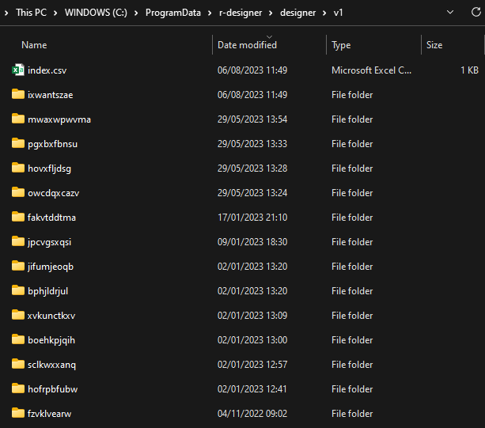

With the upcoming release of [{designer}](ashbaldry.github.io/designer/), one of the key features is the ability to save and share templates; by including it as part of the application, this removes the need to bookmark specific IDs, and makes it easier to use and maintain multiple wireframes. Instead of using the bookmark directory of the shiny application, a shared directory is created to hold all the templates that can be read by multiple users, allowing multiple people to use and update existing templates.

<figure>
<video width="600" height="400" controls>
<source src="/assets/img/blog/designer-0-3-0/designer_template_example.mp4" type="video/mp4">
</video>

<figcaption>
Saving a template using the {designer} application, and restoring the template by opening it in another session.
</figcaption>
</figure>

## Storing Templates with {rappdirs}

[{rappdirs}](https://rappdirs.r-lib.org/) is a convenient package that finds appropriate directories to save data, caches and logs, on the major operating systems. This makes it easy to develop the functionality behind saving templates on my Windows PC, knowing that it will still work when deployed on a Linux server. 

There are two levels of caching:

- *Site level* that allows all users on a computer/server to access files; and
- *User level* that allows the signed in user to access files.

The application will try to save templates in the site data directory where possible, however there will be instances where permissions have been restricted (usually professional environments), and it will fall back to the user level data directory.

Storing data in directories like this is useful in other areas, such as pulling information from APIs. An example of this can be seen in the [{pokeapi}](https://github.com/ashbaldry/pokeapi) package, where the stats of Pokémon are unlikely to change from a day to day basis. Using this cache reduces the number of API calls required when re-running the same chunk of code over and over again.

<figure>

<figcaption>
A list of all the templates currently saved in my local version of the {designer} application.
</figcaption>
</figure>

The `index.csv` collects template metadata, including the title, description and creator, and stores this alongside the ID the template is stored in. Currently only the HTML of the template is included in the folders, future updates will allow files such as screenshots to be included.

### `R_DESIGNER_CACHE`

For those that want these templates stored somewhere like a shared drive, the `R_DESIGNER_CACHE` environment variable is also available. This can point to a mounted directory so that it can be shared across multiple servers.

## Deployment

The {designer} app needs to be hosted on a server, otherwise the templates will be unable to be shared with others. In order to make this as accessible as possible, there are two built-in ways to deploy the {designer} application:

### Docker

A Dockerfile was included as part of the 0.2.0 release; this has now been enhanced to allow pulling the designer Docker image from Dockerhub under the tag [ashbaldry/designer](https://hub.docker.com/r/ashbaldry/designer#!). To get the stable version, use the tags to keep in line with the releases to CRAN, or keep as `latest` to update with the version available on the `dev` branch.

### Posit Connect

As part of the 0.3.0 release, a manifest.json file has been added to allow the application to be updated to use [Posit Connect's Git-Backed Content](https://docs.posit.co/connect/user/git-backed/). This will allow the application to be updated whenever the package is updated on CRAN. To use the stable version of the application, make sure to tie automatic updates to the `main` branch, for the most up-to-date version use the `dev` branch.

**NB** The manifest currently uses 4.2.2, so it will require that version of R to be available on the instance of Posit Connect.

#### Template Screenshots

One feature that is currently missing from these templates is providing a useful screenshot in the available templates dropdown, or generating a modal to show a catalogue of these screenshots. I have tried using [{shinyscreenshot}](https://github.com/daattali/shinyscreenshot) to capture the template and storing it with the relevant HTML. *However* it takes several seconds to capture this, and sometimes causes the app to sometimes crash. I have some ideas as to why it is happening (removing the component options from the UI makes the screenshot happen almost instantly), but I cannot find a way to fix this. If anyone knows their way around screenshotting applications, having this available in a future release would be a great addition.
